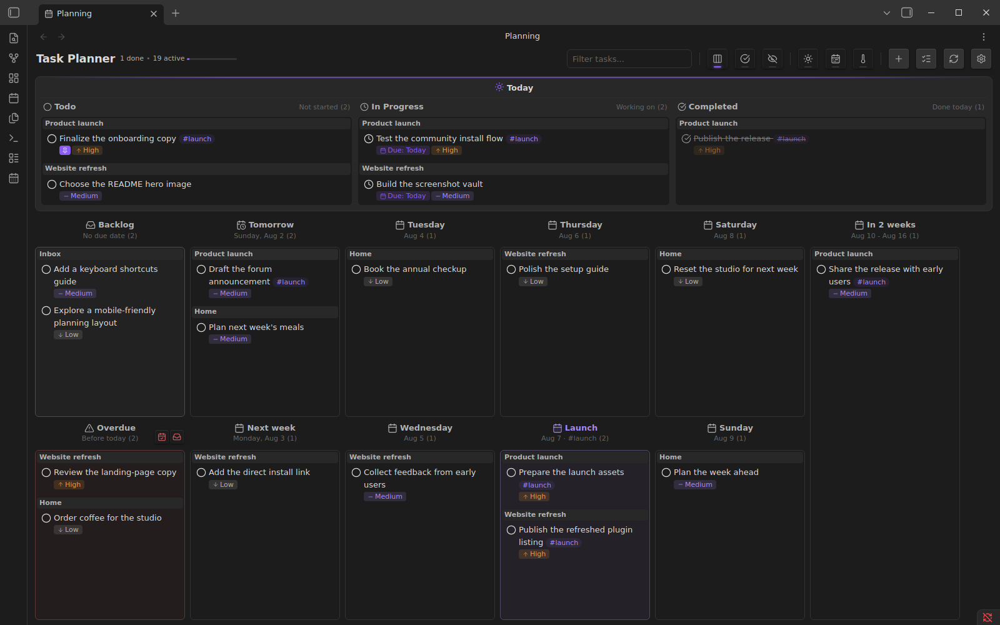

# Task Planner

**Plan the tasks already in your vault.**

Task Planner turns Markdown checkboxes across your notes into a drag-and-drop time-planning board for Today, backlog, overdue, and future horizons. Move a card and its source task updates in place.

[Install from Obsidian's plugin directory](https://obsidian.md/plugins?id=task-planner)



[](https://github.com/selfish/obsidian-task-planner/releases)
[](https://github.com/selfish/obsidian-task-planner/actions/workflows/ci.yml)
[](LICENSE)

## Why Task Planner

- **Keep tasks in your notes.** Task Planner reads ordinary Markdown checkboxes throughout your vault instead of moving them into a separate database.
- **Plan by time.** Drag tasks between Today, backlog, overdue, weekdays, weeks, months, quarters, years, or your own custom horizons.
- **See the day clearly.** Todo, In Progress, and Completed columns provide a focused daily workflow, with an optional WIP limit.
- **Update the source.** Moving a card changes the status, due date, selection state, or tag on its original Markdown task.

## Quick start

1. [Open Task Planner in Obsidian's plugin directory](https://obsidian.md/plugins?id=task-planner), then install and enable it.
2. Run **Task Planner: Open planning** from the command palette.
3. Drag tasks into Today or a future horizon. Task Planner writes the change back to the source note.

Add tasks anywhere in your vault using Markdown checkbox syntax:

```markdown
- [ ] Review the launch brief [due:: 2026-08-07] [priority:: high] #launch
- [>] Prepare the demo [due:: 2026-08-01]
```

Task Planner does not require a special task file or a separate database.

## Core capabilities

### Plan across the whole vault

- Gather tasks from any Markdown file
- Filter by task text
- Ignore selected folders or archived content
- Group cards by their source note
- Pin important tasks so they remain visible
- Collapse and expand subtasks

### Work with time horizons

- Backlog and overdue columns
- Today, tomorrow, and individual weekdays
- Configurable week, month, quarter, and year horizons
- Custom horizons based on a date and, optionally, a tag
- Today and Future focus modes
- Drag-and-drop movement between horizons

### Manage status and priority

Supported task statuses:

```markdown
- [ ] Todo
- [>] In progress
- [x] Completed
- [-] Canceled
- [d] Delegated
- [!] Attention required
```

Priority values are `critical`, `high`, `medium`, `low`, and `lowest`.

### Use readable Markdown metadata

Task Planner reads and writes Dataview-compatible inline fields:

```markdown
- [ ] Schedule the review [due:: 2026-08-10] [priority:: medium]
- [ ] Keep this visible [selected:: true]
```

Dataview is not required. The Markdown remains readable and editable without Task Planner.

Optional shorthand expansion can convert attributes when you complete a line:

- `@today` → `[due:: YYYY-MM-DD]` for the current day
- `@tomorrow` → `[due:: YYYY-MM-DD]` for the next day
- `@high` → `[priority:: high]`

## Commands

- **Open planning** — open the planning board
- **Open todo report** — review completed tasks
- **Quick add task** — create a task in the configured destination
- **Mark task as checked / unchecked** — toggle completion
- **Mark task as ongoing / unchecked** — toggle in-progress status
- **Complete line attributes** — expand enabled date, priority, and custom shortcuts

## Configuration

Open **Settings → Task Planner** to configure:

- visible day, week, month, quarter, and year horizons;
- custom dated horizons with optional tag filtering;
- the daily WIP limit;
- attribute names such as `due`, `completed`, and `selected`;
- ignored folders and archived-task filtering;
- shortcut expansion and quick-add behavior.

## Compatibility and data ownership

- Requires **Obsidian 1.8.7 or newer**
- Desktop only
- Stores tasks in user-owned Markdown files
- Uses inline fields for planning metadata
- Does not require Dataview or an external service

Task Planner updates the specific source task when you change it from the board. Keep normal vault backups or version control as you would for any tool that edits notes.

## Support

- [Report a bug or request a feature](https://github.com/selfish/obsidian-task-planner/issues)
- [View releases and release notes](https://github.com/selfish/obsidian-task-planner/releases)
- [Open the Obsidian community listing](https://community.obsidian.md/plugins/task-planner)

## Development and contributing

See [CONTRIBUTING.md](CONTRIBUTING.md) for the development environment, validation commands, real-Obsidian tests, and pull-request guidelines.

## License and attribution

Task Planner is licensed under the [GNU General Public License v2.0](LICENSE).

It is based on [Proletarian Wizard](https://github.com/cfe84/obsidian-pw) by cfe84 and contributors, also licensed under GPL v2.0.
