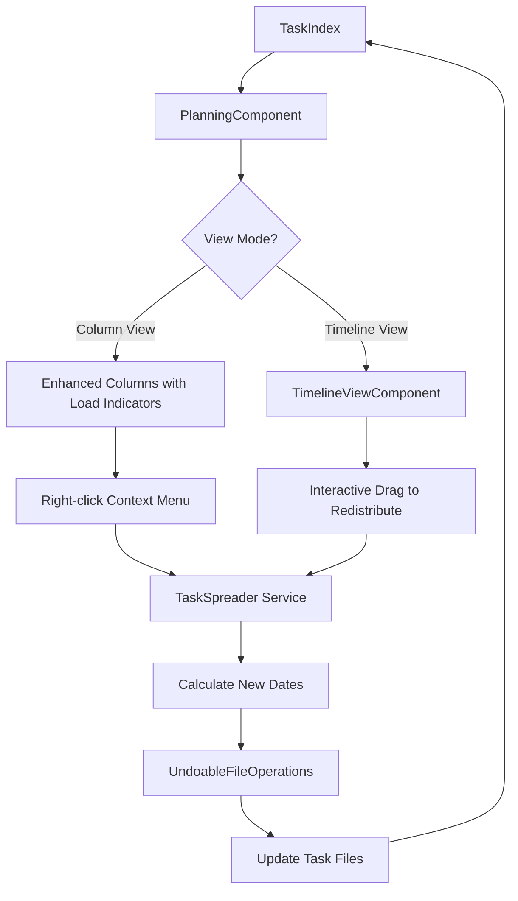

# Timeline View & Task Spreading Feature

## Implementation Status

| Phase | Status | Description |
|-------|--------|-------------|
| Phase 1 | ✅ Complete | Load Indicators & Hotspot Detection |
| Phase 2 | ✅ Complete | Task Spreader Service |
| Phase 3 | ✅ Complete | Context Menu Integration |
| Phase 4 | 🔲 Future | Timeline View (Gantt-style) |

## Overview

Add a visual timeline view to help users identify "hotspots" (days with too many tasks) and spread tasks forward based on priority. This feature enhances the existing planning view with:

1. **Visual Timeline** - A Gantt-style or enhanced column view showing task density
2. **Hotspot Detection** - Visual indicators for overloaded days
3. **Task Spreading** - Intelligent redistribution of tasks based on priority

---

## User Requirements Summary

- **Visualization**: Enhanced column view with load indicators + optional Gantt-style timeline
- **Trigger Methods**: 
  - Right-click context menu on overloaded columns
  - Interactive timeline mode for manual redistribution
- **Spreading Rules**:
  - Critical priority tasks stay on their original date
  - Lower priority tasks get pushed further forward
  - Only use weekdays that are enabled in settings
  - Balance workload across available days

---

## Architecture Design

### Component Structure

```
src/
├── core/
│   └── services/
│       └── task-spreader.ts          # NEW: Spreading algorithm logic
├── ui/
│   ├── timeline-view-component.tsx   # NEW: Gantt-style timeline view
│   ├── timeline-bar.tsx              # NEW: Individual task bar in timeline
│   ├── load-indicator.tsx            # NEW: Visual load indicator for columns
│   └── planning-task-column.tsx      # MODIFY: Add context menu & load indicator
├── utils/
│   └── workday-utils.ts              # NEW: Workday calculation utilities
└── styles/
    └── _timeline.scss                # NEW: Timeline-specific styles
```

### Data Flow Diagram



---

## Detailed Component Designs

### 1. Load Indicator Component

A visual indicator showing task density per column/day.

```typescript
interface LoadIndicatorProps {
  taskCount: number;
  wipLimit: number;
  isOverloaded: boolean;
}
```

**Visual Design:**
- Progress bar showing fill level relative to WIP limit
- Color coding: green (under limit), yellow (at limit), red (over limit)
- Tooltip showing exact count: "5 tasks (WIP limit: 3)"

### 2. Timeline View Component

A horizontal Gantt-style view showing tasks as bars across a date range.

```typescript
interface TimelineViewProps {
  tasks: TaskItem<TFile>[];
  startDate: Moment;
  endDate: Moment;
  settings: TaskPlannerSettings;
  onTaskMove: (taskId: string, newDate: string) => void;
}

interface DayColumn {
  date: Moment;
  tasks: TaskItem<TFile>[];
  isWorkday: boolean;
  loadLevel: 'light' | 'normal' | 'heavy' | 'overloaded';
}
```

**Visual Design:**
- Horizontal scrollable timeline
- Each day is a column with visual density indicator
- Tasks shown as horizontal bars (can span multiple days if needed)
- Drag-and-drop to move tasks between days
- Hotspot days highlighted with red/orange background

### 3. Task Spreader Service

Core algorithm for redistributing tasks.

```typescript
interface SpreadOptions {
  sourceDate: Moment;           // The overloaded day
  targetRange?: {               // Optional: limit spread range
    start: Moment;
    end: Moment;
  };
  respectWipLimit: boolean;     // Use WIP limit as target per day
  preserveCritical: boolean;    // Keep critical tasks in place
}

interface SpreadResult {
  moves: Array<{
    task: TaskItem<TFile>;
    fromDate: string;
    toDate: string;
  }>;
  summary: {
    tasksSpread: number;
    daysAffected: number;
  };
}

class TaskSpreader {
  constructor(settings: TaskPlannerSettings) {}
  
  // Analyze a date range and identify hotspots
  analyzeWorkload(tasks: TaskItem<TFile>[], range: DateRange): WorkloadAnalysis;
  
  // Calculate spread plan without executing
  planSpread(tasks: TaskItem<TFile>[], options: SpreadOptions): SpreadResult;
  
  // Get available workdays in range
  getAvailableWorkdays(start: Moment, end: Moment): Moment[];
}
```

### 4. Priority-Based Spreading Algorithm

```typescript
// Priority weights for spreading distance
const PRIORITY_SPREAD_WEIGHTS = {
  critical: 0,    // Never moves
  highest: 0,     // Never moves (same as critical)
  high: 1,        // Moves 1 day if needed
  medium: 2,      // Moves up to 2 days
  low: 3,         // Moves up to 3 days
  lowest: 5,      // Moves up to 5 days
  none: 4,        // No priority = treated as low-ish
};
```

**Algorithm Steps:**

1. Get all tasks for the overloaded day
2. Filter out critical/highest priority (they stay)
3. Sort remaining by priority (lowest first = moves furthest)
4. For each task to move:
   - Find next available workday with capacity
   - Respect the priority-based max distance
   - Assign task to that day
5. Return the spread plan for preview/execution

---

## UI/UX Design

### Enhanced Column View (Default)

The existing column view gets these enhancements:

1. **Load Indicator Bar** - At the top of each column header
   - Thin progress bar showing task count vs WIP limit
   - Color-coded: green → yellow → red

2. **Hotspot Styling** - Columns exceeding WIP limit get:
   - Subtle red/orange border or background tint
   - Pulsing or glowing effect (optional, can be disabled)

3. **Right-Click Context Menu** - On column header:
   - "Spread tasks forward" - Auto-distribute overload
   - "Balance this week" - Spread across the week
   - "View in timeline" - Switch to timeline view

### Timeline View Mode

A new view mode (alongside "Today" and "Future"):

1. **Toggle Button** - Add "Timeline" icon to view mode toggles
2. **Horizontal Layout** - Days as columns, tasks as rows
3. **Interactive Features**:
   - Drag task bars to new dates
   - Click on hotspot day to see spread preview
   - Bulk selection for moving multiple tasks

### Spread Preview Modal

Before executing a spread:

1. Show list of tasks that will move
2. Show before/after comparison
3. "Apply" and "Cancel" buttons
4. Option to exclude specific tasks

---

## Integration Points

### Existing Code to Modify

1. **[`src/ui/planning-component.tsx`](src/ui/planning-component.tsx:1)**
   - Add timeline view mode option
   - Pass load data to columns
   - Add spread handlers

2. **[`src/ui/planning-task-column.tsx`](src/ui/planning-task-column.tsx:1)**
   - Add LoadIndicator component
   - Add right-click context menu for spreading
   - Add hotspot styling

3. **[`src/ui/planning-settings-component.tsx`](src/ui/planning-settings-component.tsx:1)**
   - Add timeline view toggle
   - Add spread settings (if any)

4. **[`src/settings/types.ts`](src/settings/types.ts:1)**
   - Add timeline/spread related settings

5. **[`src/styles/main.scss`](src/styles/main.scss:1)**
   - Import new `_timeline.scss`

### New Files to Create

1. `src/core/services/task-spreader.ts` - Spreading algorithm
2. `src/ui/timeline-view-component.tsx` - Timeline view
3. `src/ui/timeline-bar.tsx` - Task bar in timeline
4. `src/ui/load-indicator.tsx` - Load indicator component
5. `src/ui/spread-preview-modal.tsx` - Preview before spreading
6. `src/utils/workday-utils.ts` - Workday calculations
7. `src/styles/_timeline.scss` - Timeline styles

---

## Settings Additions

```typescript
interface TimelineSettings {
  enableTimeline: boolean;           // Show timeline view option
  showLoadIndicators: boolean;       // Show load bars on columns
  hotspotThreshold: number;          // Tasks above this = hotspot (default: WIP limit)
  spreadPreviewEnabled: boolean;     // Show preview before spreading
}
```

---

## Implementation Phases

### Phase 1: Load Indicators & Hotspot Detection ✅ COMPLETE
- ✅ Add LoadIndicator component (`src/ui/load-indicator.tsx`)
- ✅ Integrate into column headers (`src/ui/planning-task-column.tsx`)
- ✅ Add hotspot styling (`src/styles/_load-indicator.scss`)
- ✅ Calculate load levels based on WIP limit
- ✅ Add tests (`__tests__/ui/load-indicator.test.tsx`)

### Phase 2: Task Spreader Service ✅ COMPLETE
- ✅ Implement spreading algorithm (`src/core/services/task-spreader.ts`)
- ✅ Add workday utilities (integrated in TaskSpreader)
- ✅ Create SpreadResult types
- ✅ Priority-based spreading (critical/highest stay, lowest moves furthest)
- ✅ Unit tests for algorithm (`__tests__/core/services/task-spreader.test.ts`)

### Phase 3: Context Menu Integration ✅ COMPLETE
- ✅ Add header action button to overloaded columns
- ✅ Implement "Spread tasks forward" action
- ✅ Integrate with undo system (each move is undoable)
- Note: Using header action button instead of right-click menu for better UX

### Phase 4: Timeline View 🔲 FUTURE
- Create TimelineViewComponent
- Add view mode toggle
- Implement drag-and-drop
- Add interactive spreading

### Phase 5: Polish & Settings 🔲 FUTURE
- Add settings for timeline features
- Keyboard shortcuts
- Accessibility improvements
- Documentation

---

## Open Questions

1. **Spread Range**: How far forward should we look for available days? (Suggestion: 2 weeks by default, configurable)

2. **Undo Granularity**: Should spreading be one undo operation or individual per task? (Suggestion: One operation for the whole spread)

3. **Recurring Tasks**: How to handle tasks that might have recurrence? (Suggestion: Treat as regular tasks for now)

4. **Custom Horizons**: Should custom horizon columns participate in spreading? (Suggestion: No, only date-based columns)

---

## Visual Mockups

### Load Indicator on Column Header

```
┌─────────────────────────────┐
│ ████████████░░░░ 8/5 tasks  │  ← Red bar, over WIP
│ Tomorrow                    │
│ Wed, Feb 5                  │
├─────────────────────────────┤
│ ┌─────────────────────────┐ │
│ │ Task 1                  │ │
│ └─────────────────────────┘ │
│ ┌─────────────────────────┐ │
│ │ Task 2                  │ │
│ └─────────────────────────┘ │
│ ...                         │
└─────────────────────────────┘
```

### Timeline View

```
         │ Mon 3 │ Tue 4 │ Wed 5 │ Thu 6 │ Fri 7 │
─────────┼───────┼───────┼───────┼───────┼───────┤
Task A   │███████│       │       │       │       │
Task B   │███████│       │       │       │       │
Task C   │       │███████│       │       │       │
Task D   │       │       │███████│       │       │
─────────┼───────┼───────┼───────┼───────┼───────┤
Load     │  🔴   │  🟢   │  🟢   │  🟢   │  🟢   │
         │  5/3  │  1/3  │  1/3  │  0/3  │  0/3  │
```

### Right-Click Context Menu

```
┌──────────────────────────┐
│ ↗ Spread tasks forward   │
│ ⚖ Balance this week      │
│ ─────────────────────────│
│ 📊 View in timeline      │
└──────────────────────────┘
```
